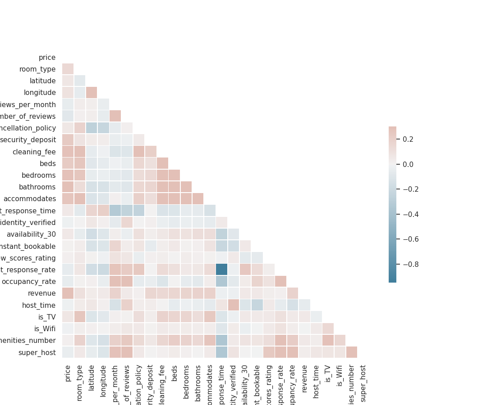

## For a complete research, please read ResearchPaper.pdf in the folder.
# Introduction
In recent years, a new form of economy, named 'sharing economy', unrolls swiftly via platforms like Airbnb. In 2009, the company launched the Superhost program to recognize the top-performing hosts who provides high-standard hosting that makes guests feel belonging anywhere. Since then, the Airbnb business has experienced a long, steady boom. Such a program has provided a great experiment for researchers to examine the external validity of signaling theory, first proposed by Michael Spence (1973) that educational credentials send information about the ability of job seekers, thus effectively helping employer distinguish highly talented workers from low ability ones. Due to Akerlof’s (1970) research on adverse selection, it has been widely acknowledged that in markets with severe information asymmetries, ‘bad’ goods can dominate the markets, dragging down the overall price. Considering the robust growth of Airbnb business, we are curious about whether superhosts indeed provides better accommodation service. Furthermore, how does such an accreditation benefit those top-performing hosts in the online rental market? Here, we explore Airbnb’s market in the United States.

# Data
To answer such questions, we will use the detailed listing and review data of 28 main U.S. cities from insideairbnb.com, an independent, non-commercial and widely used website which provides monthly scraped data from Airbnb. We select the data of August, 2019 to do our research, when huge amounts of revenue was generated due to high concentration of tourist flows.

In total, we have over 8 million reviews and 260,000 listing observations to analyze. We first upload the csv files to AWS S3 bucket, and then load the files to AWS Jupter Notebook. We use pyspark dataframe to wrangle the review data, which can automatically parallelize the code and finish the data cleaning work in a reasonable amount of time.

From the correlation heatmap, we can have a big picture of the listing dataset. In the U.S., Airbnb rent is barely correlated with superhost status, but positively correlated with the room infrastructure, like beds, bedrooms, accommodates, etc. Also, superhosts seem to receive more reviews, slightly higher review score ratings, and tend to provide better hosting service, like more actively responding to customers. From the bar plots, we can clearly see that superhosts seem not to set higher room price, but they manage to maintain a much higher occupancy rate and earn relatively more. Here, we use pyspark to draw the plots for over 260,000 observations, which greatly speeds up our programming experience against dataset of such a large scale.

# Analysis and Result

## Comment Analysis
To see what consumers care about most in a Airbnb room, we export the review data as txt file and use mrjob to find the most frequent 100 words in the reviews with review score ratings over 80 (out of 100) and those with review score ratings less than 80. In this way, we can see what consumers hate and like most in a listing. From the 2 word clouds against frequency, we can see that consumers attach great importance to geographic locations, and cleaning conditions of a room. They prefer apartments with kitchen, beautiful scenes and quiet environment. On the other hand, they cannot bear with rooms which are dirty, have difficult access to parking, and don’t have easy-to-communicate hosts. While mrjob enables us to quickly analyze the comment words, such results can only give us a rough picture of consumers’ thought. We’ll then use other pyspark machine learning models to answer our questions.

(high score review analysis)

(low score review analysis)

## Superhost Classification
Here we use superhost status as the predicted label, and price, room type index, reviews per month, cleaning fee, bathrooms, host response time, availability_30, review scores rating, revenue, amenities number, occupancy rate, host identity verified index, instant bookable index, cancellation policy index as predicting features to build logistic and forest random classification models. 

### Logistic Classification Model
We use the 5-fold cross-validated grid search to identify the optimal regParam and elasticNetParam parameters for my logistic models. Our optimal model has a training and testing AUC of around 0.844. The testing accuracy is about 0.785. This indicates a good predictive performance of our model. Therefore, we can roughly conclude that price, occupancy rate, revenue, and other features indicating the room’s basic amenities can serve as good predictors of superhost status.

### Random Forest Classification Model
In essence, random forest is an ensemble of decision trees, with each tree trained on a random subset of data. By exploiting this model, we can not only find the best decision tree model, but also identify the importance of each feature in our model. Here, we find that review scores rating as well as occupancy rate are the 2 most important features to identify a superhost. Surprisingly, price is the least important feature. Therefore, we assume that superhosts benefit from the top-performing accreditation by maintaining a higher occupancy rate rather than setting a higher price.

## Linear Regression Model

To verify our assumption, we use pyspark.ml package to fit 2 linear regression models, one with price as the predicted variable (Model 1), and the other with revenue as the predicted variable (Model 2). In Model 1, the coefficient of super_host is -12.86, revealing that superhosts tend to set a lower price than normal hosts. In Model 2, we find that superhosts tend to earn around 157.99 dollars more than normal ones, and that one percentage increase in occupancy rate can lead to an increase of about 40.97 dollars income. Even though the MRSE of both models are relatively high, considering that we have a total number of over 260,000 observations, we can state that our models are still valid and the predicting error is within reasonable range.

(Model 1)

(Model 2)

# Conclusion
From the analysis about, we conclude that (1) consumers prefer rooms with clean, quiet environment, complete amenities, and easy-to-communicate hosts; (2) superhosts do have better performance than normal ones (their rooms have more amenities, and they communicate with consumers more actively); (3) superhosts increase their income mainly by maintaining a higher occupancy rate and reducing their room price. Therefore, the external validity of signaling theory in the Airbnb U.S. market is verified by our research.

# Reference
Akerlof, G. A. (1970). The Market for “Lemons”: Quality Uncertainty and the Market Mechanism. Quarterly Journal of Economics, 84(3), 488–500.

Chattopadhyay, M. & Mitra, S. K. (2019). Do airbnb host listing attributes influence room pricing homogenously? International Journal of Hospitality Management, 81(8), 54-64.

