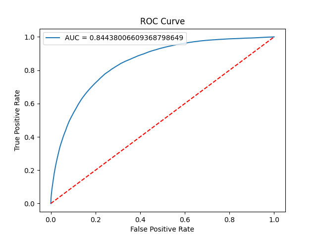

```pyspark
# df = spark.read.option("header", True).csv("s3://projectyfl12/listings/ls.csv")
df = spark.read.csv('s3://projectyfl12/listings/ls.csv',
                      sep=",",
                      header=True,
                      inferSchema=True)
```


    VBox()


    FloatProgress(value=0.0, bar_style='info', description='Progress:', layout=Layout(height='25px', width='50%'),…


```pyspark
df = df.withColumn("reviews_per_month", df.reviews_per_month.cast("double"))
df = df.withColumn("accommodates", df.accommodates.cast("integer"))
df = df.withColumn('super_host', (df.host_is_superhost == 't').cast("integer"))
```


    VBox()


    FloatProgress(value=0.0, bar_style='info', description='Progress:', layout=Layout(height='25px', width='50%'),…


```pyspark
df.printSchema()
```


    VBox()


    FloatProgress(value=0.0, bar_style='info', description='Progress:', layout=Layout(height='25px', width='50%'),…


    root
     |-- _c0: string (nullable = true)
     |-- host_is_superhost: string (nullable = true)
     |-- city: string (nullable = true)
     |-- price: double (nullable = true)
     |-- room_type: string (nullable = true)
     |-- latitude: double (nullable = true)
     |-- longitude: double (nullable = true)
     |-- reviews_per_month: double (nullable = true)
     |-- number_of_reviews: double (nullable = true)
     |-- cancellation_policy: string (nullable = true)
     |-- security_deposit: double (nullable = true)
     |-- cleaning_fee: double (nullable = true)
     |-- beds: double (nullable = true)
     |-- bedrooms: double (nullable = true)
     |-- bathrooms: double (nullable = true)
     |-- accommodates: integer (nullable = true)
     |-- host_response_time: double (nullable = true)
     |-- host_identity_verified: string (nullable = true)
     |-- availability_30: double (nullable = true)
     |-- instant_bookable: string (nullable = true)
     |-- review_scores_rating: double (nullable = true)
     |-- host_response_rate: double (nullable = true)
     |-- occupancy_rate: double (nullable = true)
     |-- revenue: double (nullable = true)
     |-- host_time: integer (nullable = true)
     |-- is_TV: integer (nullable = true)
     |-- is_Wifi: integer (nullable = true)
     |-- amenities_number: integer (nullable = true)


```pyspark
from pyspark.ml.feature import StringIndexer
from pyspark.ml import Pipeline
from pyspark.ml.feature import VectorAssembler
from pyspark.ml.classification import DecisionTreeClassifier


```


    VBox()


    FloatProgress(value=0.0, bar_style='info', description='Progress:', layout=Layout(height='25px', width='50%'),…


```pyspark
df = df.dropna()
cols = ['super_host','city',
             'price','room_type',
             'reviews_per_month','number_of_reviews', 
             'cancellation_policy', 'security_deposit', 
             'cleaning_fee', 'beds', 'bedrooms', 'bathrooms',
             'accommodates', 'host_response_time', 
             'host_identity_verified', 'availability_30', 
             'instant_bookable','review_scores_rating',
             'host_response_rate', 'occupancy_rate', 'revenue',
             'host_time', 'is_TV', 'is_Wifi', 'amenities_number']
sample = df[cols]
```


    VBox()


    FloatProgress(value=0.0, bar_style='info', description='Progress:', layout=Layout(height='25px', width='50%'),…


```pyspark
indexer_ib = StringIndexer(inputCol="instant_bookable",outputCol="instant_bookable_idx")

indexer_hd = StringIndexer(inputCol="host_identity_verified",outputCol="host_identity_verified_idx")
indexer_cp = StringIndexer(inputCol="cancellation_policy",outputCol="cancellation_policy_idx")
indexer_rt = StringIndexer(inputCol="room_type",outputCol="room_type_idx")

# indexer_sph = StringIndexer(inputCol="host_is_superhost",outputCol="superhost_idx")


features = ['price', 'room_type_idx', 'reviews_per_month', 'cleaning_fee', 'bathrooms', 'host_response_time',
         'availability_30', 'review_scores_rating', 'revenue', 'amenities_number', 'occupancy_rate',
         'host_identity_verified_idx', 'instant_bookable_idx', 'cancellation_policy_idx']


assembler = VectorAssembler(inputCols=features, outputCol='features')

train, test = sample.randomSplit([0.7, 0.3])

lr = LogisticRegression(featuresCol='features', labelCol='super_host')
# tree = DecisionTreeClassifier(featuresCol='features', labelCol='super_host')

pipeline_lr = Pipeline(stages=[indexer_ib, indexer_hd, indexer_cp, indexer_rt, assembler, lr])
# pipeline_tree = Pipeline(stages=[indexer_ib, indexer_hd, indexer_cp, indexer_rt, assembler, tree])
```


    VBox()


    FloatProgress(value=0.0, bar_style='info', description='Progress:', layout=Layout(height='25px', width='50%'),…


```pyspark
import numpy as np
from pyspark.ml.evaluation import BinaryClassificationEvaluator
from pyspark.ml.tuning import CrossValidator, ParamGridBuilder

import seaborn as sns
import matplotlib.pyplot as plt
```


    VBox()


    FloatProgress(value=0.0, bar_style='info', description='Progress:', layout=Layout(height='25px', width='50%'),…


```pyspark
params = ParamGridBuilder()
params = params.addGrid(lr.regParam, np.arange(0, .1, .01))
params = params.addGrid(lr.elasticNetParam, [0,1])
params = params.build()
            

evaluator = BinaryClassificationEvaluator(labelCol = 'super_host')
cv = CrossValidator(estimator=pipeline_lr,
                    estimatorParamMaps=params,
                    evaluator=evaluator, 
                    numFolds=5,
                    seed=3)
```


    VBox()


    FloatProgress(value=0.0, bar_style='info', description='Progress:', layout=Layout(height='25px', width='50%'),…


```pyspark
train.printSchema()
```


    VBox()


    FloatProgress(value=0.0, bar_style='info', description='Progress:', layout=Layout(height='25px', width='50%'),…


    root
     |-- host_is_superhost: string (nullable = true)
     |-- city: string (nullable = true)
     |-- price: double (nullable = true)
     |-- room_type: string (nullable = true)
     |-- latitude: double (nullable = true)
     |-- longitude: double (nullable = true)
     |-- reviews_per_month: double (nullable = true)
     |-- number_of_reviews: double (nullable = true)
     |-- cancellation_policy: string (nullable = true)
     |-- security_deposit: double (nullable = true)
     |-- cleaning_fee: double (nullable = true)
     |-- beds: double (nullable = true)
     |-- bedrooms: double (nullable = true)
     |-- bathrooms: double (nullable = true)
     |-- accommodates: integer (nullable = true)
     |-- host_response_time: double (nullable = true)
     |-- host_identity_verified: string (nullable = true)
     |-- availability_30: double (nullable = true)
     |-- instant_bookable: string (nullable = true)
     |-- review_scores_rating: double (nullable = true)
     |-- host_response_rate: double (nullable = true)
     |-- occupancy_rate: double (nullable = true)
     |-- revenue: double (nullable = true)
     |-- host_time: integer (nullable = true)
     |-- is_TV: integer (nullable = true)
     |-- is_Wifi: integer (nullable = true)
     |-- amenities_number: integer (nullable = true)


```pyspark
cv = cv.fit(train)
```


    VBox()


    FloatProgress(value=0.0, bar_style='info', description='Progress:', layout=Layout(height='25px', width='50%'),…


    Exception in thread cell_monitor-195:
    Traceback (most recent call last):
      File "/opt/conda/lib/python3.7/threading.py", line 926, in _bootstrap_inner
        self.run()
      File "/opt/conda/lib/python3.7/threading.py", line 870, in run
        self._target(*self._args, **self._kwargs)
      File "/opt/conda/lib/python3.7/site-packages/awseditorssparkmonitoringwidget-1.0-py3.7.egg/awseditorssparkmonitoringwidget/cellmonitor.py", line 178, in cell_monitor
        job_binned_stages[job_id][stage_id] = all_stages[stage_id]
    KeyError: 22418
    


```pyspark
optimal_model = cv.bestModel

trainingSummary = optimal_model.stages[-1].summary
prediction = optimal_model.transform(test)


```


    VBox()


    FloatProgress(value=0.0, bar_style='info', description='Progress:', layout=Layout(height='25px', width='50%'),…


```pyspark
test_updated = prediction[['price', 'room_type', 'reviews_per_month', 'cleaning_fee', 'bathrooms', 'host_response_time',
         'availability_30', 'review_scores_rating', 'revenue', 'amenities_number', 'occupancy_rate',
         'host_identity_verified', 'instant_bookable', 'cancellation_policy', 'super_host', 'features']]

evaluationSummary = optimal_model.stages[-1].evaluate(test_updated)
```


    VBox()


    FloatProgress(value=0.0, bar_style='info', description='Progress:', layout=Layout(height='25px', width='50%'),…


```pyspark
print("Training AUC: " + str(trainingSummary.areaUnderROC))
print("Test AUC: ", str(evaluationSummary.areaUnderROC))

print("\nFalse positive rate by label (Training):")
for i, rate in enumerate(trainingSummary.falsePositiveRateByLabel):
    print("label %d: %s" % (i, rate))

print("\nTrue positive rate by label (Training):")
for i, rate in enumerate(trainingSummary.truePositiveRateByLabel):
    print("label %d: %s" % (i, rate))
    
print("\nTraining Accuracy: " + str(trainingSummary.accuracy))
print("Test Accuracy: ", str(evaluationSummary.accuracy))
```


    VBox()


    FloatProgress(value=0.0, bar_style='info', description='Progress:', layout=Layout(height='25px', width='50%'),…


    Training AUC: 0.8441970106910917
    Test AUC:  0.844380066093688
    
    False positive rate by label (Training):
    label 0: 0.39183992808749357
    label 1: 0.1287097195468347
    
    True positive rate by label (Training):
    label 0: 0.8712902804531653
    label 1: 0.6081600719125064
    
    Training Accuracy: 0.7847186851343728
    Test Accuracy:  0.7845505617977528


```pyspark
roc_df = evaluationSummary.roc.toPandas()
roc_df.plot(x = 'FPR', y = 'TPR',label = 'AUC = %0.20f' % evaluationSummary.areaUnderROC)

plt.legend(loc = 'upper left')
plt.plot([0, 1], [0, 1],'r--')
plt.ylabel('True Positive Rate')
plt.xlabel('False Positive Rate')
plt.title('ROC Curve')

%matplot plt
```


    VBox()


    FloatProgress(value=0.0, bar_style='info', description='Progress:', layout=Layout(height='25px', width='50%'),…


    

    


```pyspark

```


```pyspark
df_m = spark.read.csv('s3://projectyfl12/listings/ls.csv',
                      sep=",",
                      header=True,
                      inferSchema=True)

df_m = df_m.withColumn("reviews_per_month", df_m.reviews_per_month.cast("double"))
df_m = df_m.withColumn("accommodates", df_m.accommodates.cast("integer"))
df_m = df_m.withColumn('super_host', (df_m.host_is_superhost == 't').cast("integer"))
```


    VBox()


    FloatProgress(value=0.0, bar_style='info', description='Progress:', layout=Layout(height='25px', width='50%'),…


```pyspark

```


```pyspark

cols = ['super_host','city',
             'price','room_type','latitude','longitude',
             'reviews_per_month','number_of_reviews', 
             'cancellation_policy', 'security_deposit', 
             'cleaning_fee', 'beds', 'bedrooms', 'bathrooms',
             'accommodates', 'host_response_time', 
             'host_identity_verified', 'availability_30', 
             'instant_bookable','review_scores_rating',
             'host_response_rate', 'occupancy_rate', 'revenue',
             'host_time', 'is_TV', 'is_Wifi', 'amenities_number']
df_m = df_m[cols]
```


    VBox()


    FloatProgress(value=0.0, bar_style='info', description='Progress:', layout=Layout(height='25px', width='50%'),…


```pyspark

df_m = df_m.dropna()

Indexer_ib = StringIndexer(inputCol="instant_bookable",outputCol="instant_bookable_idx")

Indexer_hv = StringIndexer(inputCol="host_identity_verified",outputCol="host_identity_verified_idx")
Indexer_cp = StringIndexer(inputCol="cancellation_policy",outputCol="cancellation_policy_idx")
Indexer_rt = StringIndexer(inputCol="room_type",outputCol="room_type_idx")


features = ['price', 'room_type_idx', 'reviews_per_month', 'cleaning_fee', 'bathrooms', 'host_response_time',
         'availability_30', 'review_scores_rating', 'revenue', 'amenities_number', 'occupancy_rate',
         'host_identity_verified_idx', 'instant_bookable_idx', 'cancellation_policy_idx']


assembler_tr = VectorAssembler(inputCols=features, outputCol='features')

tree = DecisionTreeClassifier(featuresCol='features', labelCol='super_host')

train1, test1 = df_m.randomSplit([0.7, 0.3])

pipeline = Pipeline(stages=[Indexer_ib, Indexer_hv, Indexer_cp, Indexer_rt, assembler_tr, tree])

```


    VBox()


    FloatProgress(value=0.0, bar_style='info', description='Progress:', layout=Layout(height='25px', width='50%'),…


```pyspark
pipeline = pipeline.fit(train1)

predictions = pipeline.transform(test1)
```


    VBox()


    FloatProgress(value=0.0, bar_style='info', description='Progress:', layout=Layout(height='25px', width='50%'),…


```pyspark
predictions.groupBy("super_host", "prediction").count().show()
```


    VBox()


    FloatProgress(value=0.0, bar_style='info', description='Progress:', layout=Layout(height='25px', width='50%'),…


    +----------+----------+-----+
    |super_host|prediction|count|
    +----------+----------+-----+
    |         1|       1.0|15976|
    |         0|       0.0|47094|
    |         0|       1.0| 5737|
    |         1|       0.0| 9689|
    +----------+----------+-----+


```pyspark
accuracy = (15976 + 9689) / (15976 + 9689 + 47094 + 5737)
print('accuracy: ', accuracy)
```


    VBox()


    FloatProgress(value=0.0, bar_style='info', description='Progress:', layout=Layout(height='25px', width='50%'),…


    accuracy:  0.3269593355075418


```pyspark

```


    VBox()


    FloatProgress(value=0.0, bar_style='info', description='Progress:', layout=Layout(height='25px', width='50%'),…


```pyspark

```


```pyspark

```


```pyspark

```


```pyspark

```


```pyspark
dff = spark.read.csv('s3://projectyfl12/listings/ls.csv',
                      sep=",",
                      header=True,
                      inferSchema=True)

dff = dff.withColumn("reviews_per_month", dff.reviews_per_month.cast("double"))
dff = dff.withColumn("accommodates", dff.accommodates.cast("integer"))
dff = dff.withColumn('super_host', (dff.host_is_superhost == 't').cast("integer"))
```


    VBox()


    FloatProgress(value=0.0, bar_style='info', description='Progress:', layout=Layout(height='25px', width='50%'),…


```pyspark
from pyspark.ml.classification import RandomForestClassifier

```


    VBox()


    FloatProgress(value=0.0, bar_style='info', description='Progress:', layout=Layout(height='25px', width='50%'),…


```pyspark
dff = dff.dropna()

dff = StringIndexer(inputCol="instant_bookable",outputCol="instant_bookable_idx").fit(dff).transform(dff)

dff = StringIndexer(inputCol="host_identity_verified",outputCol="host_identity_verified_idx").fit(dff).transform(dff)
dff = StringIndexer(inputCol="cancellation_policy",outputCol="cancellation_policy_idx").fit(dff).transform(dff)
dff = StringIndexer(inputCol="room_type",outputCol="room_type_idx").fit(dff).transform(dff)


features = ['price', 'room_type_idx', 'reviews_per_month', 'cleaning_fee', 'bathrooms', 'host_response_time',
         'availability_30', 'review_scores_rating', 'revenue', 'amenities_number', 'occupancy_rate',
         'host_identity_verified_idx', 'instant_bookable_idx', 'cancellation_policy_idx']


assembler_f = VectorAssembler(inputCols=features, outputCol='features')

dff = assembler_f.transform(dff)

forest = RandomForestClassifier(featuresCol='features', labelCol='super_host', numTrees=5)
# tree = DecisionTreeClassifier(featuresCol='features', labelCol='super_host')

train2, test2 = dff.randomSplit([0.7, 0.3])

forest = forest.fit(train2)
forest.trees
```


    VBox()


    FloatProgress(value=0.0, bar_style='info', description='Progress:', layout=Layout(height='25px', width='50%'),…


    [DecisionTreeClassificationModel (uid=dtc_7a3753601ead) of depth 5 with 19 nodes, DecisionTreeClassificationModel (uid=dtc_8f686cc8e29f) of depth 5 with 23 nodes, DecisionTreeClassificationModel (uid=dtc_c3a5a40a4b00) of depth 5 with 39 nodes, DecisionTreeClassificationModel (uid=dtc_25ec897c89bc) of depth 5 with 17 nodes, DecisionTreeClassificationModel (uid=dtc_a2a3f6a7bbf1) of depth 5 with 29 nodes]


```pyspark
prediction = forest.transform(test2)
```


    VBox()


    FloatProgress(value=0.0, bar_style='info', description='Progress:', layout=Layout(height='25px', width='50%'),…


```pyspark
forest.featureImportances
```


    VBox()


    FloatProgress(value=0.0, bar_style='info', description='Progress:', layout=Layout(height='25px', width='50%'),…


    SparseVector(14, {0: 0.001, 1: 0.0004, 2: 0.1409, 3: 0.0157, 4: 0.0003, 5: 0.0914, 6: 0.0035, 7: 0.3995, 8: 0.0112, 9: 0.0505, 10: 0.2685, 11: 0.0026, 12: 0.0005, 13: 0.0141})


```pyspark
#occupancy_rate is the most important!!
```


```pyspark
features = ['price', 'room_type_idx', 'reviews_per_month', 'cleaning_fee', 'bathrooms', 'host_response_time',
         'availability_30', 'review_scores_rating', 'revenue', 'amenities_number', 'occupancy_rate',
         'host_identity_verified_idx', 'instant_bookable_idx', 'cancellation_policy_idx']
```


```pyspark

```


```pyspark

```


```pyspark

```


```pyspark

```


```pyspark

```


```pyspark

```


```pyspark

```


```pyspark

```


```pyspark

```
