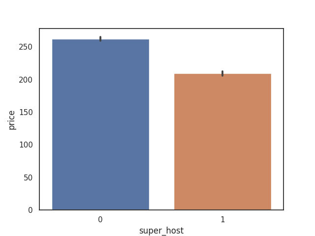
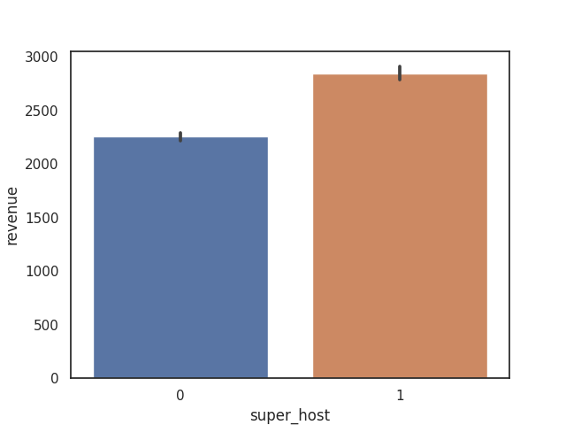
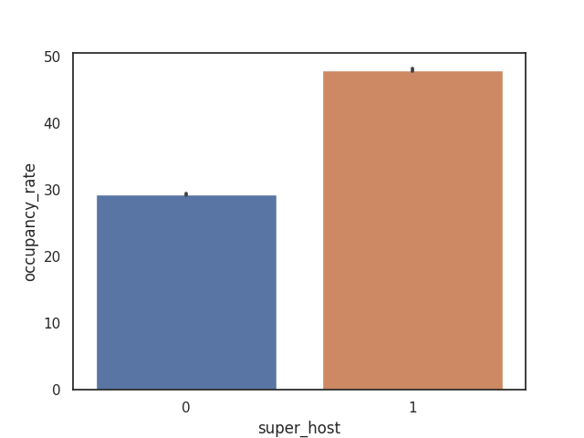
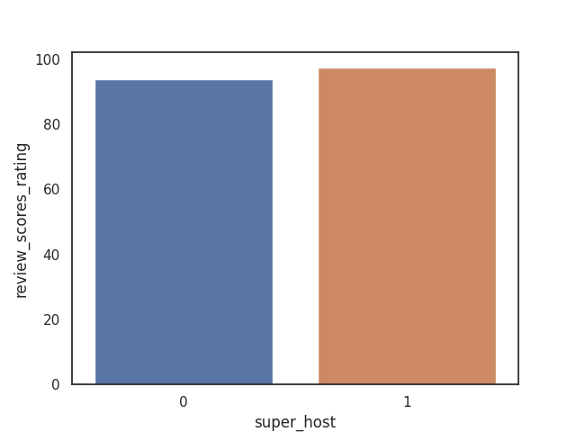

```pyspark
df = spark.read.csv('s3://projectyfl12/listings/ls.csv',
                      sep=",",
                      header=True,
                      inferSchema=True)
```


    VBox()


    Starting Spark application


<table>
<tr><th>ID</th><th>YARN Application ID</th><th>Kind</th><th>State</th><th>Spark UI</th><th>Driver log</th><th>Current session?</th></tr><tr><td>5</td><td>application_1607541500596_0006</td><td>pyspark</td><td>idle</td><td></td><td></td><td>✔</td></tr></table>


    FloatProgress(value=0.0, bar_style='info', description='Progress:', layout=Layout(height='25px', width='50%'),…


    SparkSession available as 'spark'.


    FloatProgress(value=0.0, bar_style='info', description='Progress:', layout=Layout(height='25px', width='50%'),…


```pyspark
df = df.withColumn("reviews_per_month", df.reviews_per_month.cast("double"))
df = df.withColumn("accommodates", df.accommodates.cast("integer"))
df = df.withColumn('super_host', (df.host_is_superhost == 't').cast("integer"))
```


    VBox()


    FloatProgress(value=0.0, bar_style='info', description='Progress:', layout=Layout(height='25px', width='50%'),…


```pyspark

sc.install_pypi_package("seaborn")
sc.install_pypi_package("pandas")
```


    VBox()


    FloatProgress(value=0.0, bar_style='info', description='Progress:', layout=Layout(height='25px', width='50%'),…


    Collecting seaborn
      Using cached https://files.pythonhosted.org/packages/bc/45/5118a05b0d61173e6eb12bc5804f0fbb6f196adb0a20e0b16efc2b8e98be/seaborn-0.11.0-py3-none-any.whl
    Requirement already satisfied: numpy>=1.15 in /usr/local/lib64/python3.7/site-packages (from seaborn)
    Collecting scipy>=1.0 (from seaborn)
      Using cached https://files.pythonhosted.org/packages/dc/7e/8f6a79b102ca1ea928bae8998b05bf5dc24a90571db13cd119f275ba6252/scipy-1.5.4-cp37-cp37m-manylinux1_x86_64.whl
    Collecting matplotlib>=2.2 (from seaborn)
      Using cached https://files.pythonhosted.org/packages/30/f2/10c822cb0ca5ebec58bd1892187bc3e3db64a867ac26531c6204663fc218/matplotlib-3.3.3-cp37-cp37m-manylinux1_x86_64.whl
    Collecting pandas>=0.23 (from seaborn)
      Using cached https://files.pythonhosted.org/packages/fd/70/e8eee0cbddf926bf51958c7d6a86bc69167c300fa2ba8e592330a2377d1b/pandas-1.1.5-cp37-cp37m-manylinux1_x86_64.whl
    Collecting python-dateutil>=2.1 (from matplotlib>=2.2->seaborn)
      Using cached https://files.pythonhosted.org/packages/d4/70/d60450c3dd48ef87586924207ae8907090de0b306af2bce5d134d78615cb/python_dateutil-2.8.1-py2.py3-none-any.whl
    Collecting pyparsing!=2.0.4,!=2.1.2,!=2.1.6,>=2.0.3 (from matplotlib>=2.2->seaborn)
      Using cached https://files.pythonhosted.org/packages/8a/bb/488841f56197b13700afd5658fc279a2025a39e22449b7cf29864669b15d/pyparsing-2.4.7-py2.py3-none-any.whl
    Collecting pillow>=6.2.0 (from matplotlib>=2.2->seaborn)
      Using cached https://files.pythonhosted.org/packages/af/fa/c1302a26d5e1a17fa8e10e43417b6cf038b0648c4b79fcf2302a4a0c5d30/Pillow-8.0.1-cp37-cp37m-manylinux1_x86_64.whl
    Collecting cycler>=0.10 (from matplotlib>=2.2->seaborn)
      Using cached https://files.pythonhosted.org/packages/f7/d2/e07d3ebb2bd7af696440ce7e754c59dd546ffe1bbe732c8ab68b9c834e61/cycler-0.10.0-py2.py3-none-any.whl
    Collecting kiwisolver>=1.0.1 (from matplotlib>=2.2->seaborn)
      Using cached https://files.pythonhosted.org/packages/d2/46/231de802ade4225b76b96cffe419cf3ce52bbe92e3b092cf12db7d11c207/kiwisolver-1.3.1-cp37-cp37m-manylinux1_x86_64.whl
    Requirement already satisfied: pytz>=2017.2 in /usr/local/lib/python3.7/site-packages (from pandas>=0.23->seaborn)
    Requirement already satisfied: six>=1.5 in /usr/local/lib/python3.7/site-packages (from python-dateutil>=2.1->matplotlib>=2.2->seaborn)
    Installing collected packages: scipy, python-dateutil, pyparsing, pillow, cycler, kiwisolver, matplotlib, pandas, seaborn
    Successfully installed cycler-0.10.0 kiwisolver-1.3.1 matplotlib-3.3.3 pandas-1.1.5 pillow-8.0.1 pyparsing-2.4.7 python-dateutil-2.8.1 scipy-1.5.4 seaborn-0.11.0
    
    Requirement already satisfied: pandas in /mnt/tmp/1607684506462-0/lib/python3.7/site-packages
    Requirement already satisfied: numpy>=1.15.4 in /usr/local/lib64/python3.7/site-packages (from pandas)
    Requirement already satisfied: pytz>=2017.2 in /usr/local/lib/python3.7/site-packages (from pandas)
    Requirement already satisfied: python-dateutil>=2.7.3 in /mnt/tmp/1607684506462-0/lib/python3.7/site-packages (from pandas)
    Requirement already satisfied: six>=1.5 in /usr/local/lib/python3.7/site-packages (from python-dateutil>=2.7.3->pandas)


```pyspark
import seaborn as sns
import matplotlib.pyplot as plt
from string import ascii_letters
import numpy as np
from string import ascii_letters
```


    VBox()


    FloatProgress(value=0.0, bar_style='info', description='Progress:', layout=Layout(height='25px', width='50%'),…


```pyspark
df_p = df.toPandas()
```


    VBox()


    FloatProgress(value=0.0, bar_style='info', description='Progress:', layout=Layout(height='25px', width='50%'),…


```pyspark
df_p.info()
```


    VBox()


    FloatProgress(value=0.0, bar_style='info', description='Progress:', layout=Layout(height='25px', width='50%'),…


    <class 'pandas.core.frame.DataFrame'>
    RangeIndex: 260917 entries, 0 to 260916
    Data columns (total 29 columns):
     #   Column                  Non-Null Count   Dtype  
    ---  ------                  --------------   -----  
     0   _c0                     260917 non-null  object 
     1   host_is_superhost       260917 non-null  object 
     2   city                    260917 non-null  object 
     3   price                   260913 non-null  float64
     4   room_type               260913 non-null  object 
     5   latitude                260913 non-null  float64
     6   longitude               260913 non-null  float64
     7   reviews_per_month       260909 non-null  float64
     8   number_of_reviews       260913 non-null  float64
     9   cancellation_policy     260913 non-null  object 
     10  security_deposit        260913 non-null  float64
     11  cleaning_fee            260913 non-null  float64
     12  beds                    260913 non-null  float64
     13  bedrooms                260913 non-null  float64
     14  bathrooms               260913 non-null  float64
     15  accommodates            260909 non-null  float64
     16  host_response_time      260913 non-null  float64
     17  host_identity_verified  260913 non-null  object 
     18  availability_30         260913 non-null  float64
     19  instant_bookable        260913 non-null  object 
     20  review_scores_rating    260913 non-null  float64
     21  host_response_rate      260913 non-null  float64
     22  occupancy_rate          260913 non-null  float64
     23  revenue                 260913 non-null  float64
     24  host_time               260913 non-null  float64
     25  is_TV                   260913 non-null  float64
     26  is_Wifi                 260909 non-null  float64
     27  amenities_number        260909 non-null  float64
     28  super_host              260917 non-null  int32  
    dtypes: float64(21), int32(1), object(7)
    memory usage: 56.7+ MB


```pyspark
df_p['cancellation_policy'] = df_p['cancellation_policy'].where(df_p['cancellation_policy'] != 'flexible', 1.0)

df_p['cancellation_policy'] = df_p['cancellation_policy'].where(df_p['cancellation_policy'] != 'luxury_moderate', 2.0)
df_p['cancellation_policy'] = df_p['cancellation_policy'].where(df_p['cancellation_policy'] != 'luxury_super_strict_95', 7.0)
df_p['cancellation_policy'] = df_p['cancellation_policy'].where(df_p['cancellation_policy'] != 'luxury_super_strict_125', 8.0)
df_p['cancellation_policy'] = df_p['cancellation_policy'].where(df_p['cancellation_policy'] != 'luxury_no_refund', 9.0)


df_p['cancellation_policy'] = df_p['cancellation_policy'].where(df_p['cancellation_policy'] != 'moderate', 2.0)
df_p['cancellation_policy'] = df_p['cancellation_policy'].where(df_p['cancellation_policy'] != 'strict_14_with_grace_period', 3.0)
df_p['cancellation_policy'] = df_p['cancellation_policy'].where(df_p['cancellation_policy'] != 'strict', 4.0)
df_p['cancellation_policy'] = df_p['cancellation_policy'].where(df_p['cancellation_policy'] != 'super_strict_30', 5.0)
df_p['cancellation_policy'] = df_p['cancellation_policy'].where(df_p['cancellation_policy'] != 'super_strict_60', 6.0)
df_p['cancellation_policy'] = df_p['cancellation_policy'].astype('float')
df_p = df_p[df_p.cancellation_policy <= 10] 
```


    VBox()


    FloatProgress(value=0.0, bar_style='info', description='Progress:', layout=Layout(height='25px', width='50%'),…


```pyspark
# deal with room_type
df_p['room_type'] = df_p['room_type'].where(df_p['room_type'] != 'Shared room', 1.0)
df_p['room_type'] = df_p['room_type'].where(df_p['room_type'] != 'Private room', 2.0)
df_p['room_type'] = df_p['room_type'].where(df_p['room_type'] != 'Entire home/apt', 3.0)
df_p['room_type'] = df_p['room_type'].where(df_p['room_type'] != 'Hotel room', 4.0)

df_p['room_type'] = df_p['room_type'].astype('float64')

```


    VBox()


    FloatProgress(value=0.0, bar_style='info', description='Progress:', layout=Layout(height='25px', width='50%'),…


```pyspark
def booleans_to_numbers(s):
    if s == 'f':
        return 0
    elif s == 't':
        return 1
    return None

boolean_cols = ['host_identity_verified', 'instant_bookable']
for col in boolean_cols:
    print(col)
    df_p[col] = df_p[col].apply(booleans_to_numbers)
```


    VBox()


    FloatProgress(value=0.0, bar_style='info', description='Progress:', layout=Layout(height='25px', width='50%'),…


    host_identity_verified
    instant_bookable


```pyspark
df_p.columns
```


    VBox()


    FloatProgress(value=0.0, bar_style='info', description='Progress:', layout=Layout(height='25px', width='50%'),…


    Index(['_c0', 'host_is_superhost', 'city', 'price', 'room_type', 'latitude',
           'longitude', 'reviews_per_month', 'number_of_reviews',
           'cancellation_policy', 'security_deposit', 'cleaning_fee', 'beds',
           'bedrooms', 'bathrooms', 'accommodates', 'host_response_time',
           'host_identity_verified', 'availability_30', 'instant_bookable',
           'review_scores_rating', 'host_response_rate', 'occupancy_rate',
           'revenue', 'host_time', 'is_TV', 'is_Wifi', 'amenities_number',
           'super_host'],
          dtype='object')


```pyspark

```


```pyspark
plt.close()
sns.set_theme(style="white")


d = df_p[['price', 'room_type', 'latitude',
       'longitude', 'reviews_per_month', 'number_of_reviews',
       'cancellation_policy', 'security_deposit', 'cleaning_fee', 'beds',
       'bedrooms', 'bathrooms', 'accommodates', 'host_response_time',
       'host_identity_verified', 'availability_30', 'instant_bookable',
       'review_scores_rating', 'host_response_rate', 'occupancy_rate',
       'revenue', 'host_time', 'is_TV', 'is_Wifi', 'amenities_number',
       'super_host']].copy()

# Compute the correlation matrix
corr = d.corr()

# Generate a mask for the upper triangle
mask = np.triu(np.ones_like(corr, dtype=bool))

# Set up the matplotlib figure
f, ax = plt.subplots(figsize=(11, 9))

# Generate a custom diverging colormap
cmap = sns.diverging_palette(230, 20, as_cmap=True)

# Draw the heatmap with the mask and correct aspect ratio
sns.heatmap(corr, mask=mask, cmap=cmap, vmax=.3, center=0,
            square=True, linewidths=.5, cbar_kws={"shrink": .5})
%matplot plt
```


    VBox()


    FloatProgress(value=0.0, bar_style='info', description='Progress:', layout=Layout(height='25px', width='50%'),…


    

    


```pyspark
plt.close()

sns.barplot(x='super_host', y='price', data=df_p)
%matplot plt
```


    VBox()


    FloatProgress(value=0.0, bar_style='info', description='Progress:', layout=Layout(height='25px', width='50%'),…


    

    


```pyspark
plt.close()

sns.barplot(x='super_host', y='revenue', data=df_p)
%matplot plt
```


    VBox()


    FloatProgress(value=0.0, bar_style='info', description='Progress:', layout=Layout(height='25px', width='50%'),…


    

    


```pyspark
plt.close()

sns.barplot(x='super_host', y='occupancy_rate', data=df_p)
%matplot plt
```


    VBox()


    FloatProgress(value=0.0, bar_style='info', description='Progress:', layout=Layout(height='25px', width='50%'),…


    

    


```pyspark
plt.close()

sns.barplot(x='super_host', y='review_scores_rating', data=df_p)
%matplot plt
```


    VBox()


    FloatProgress(value=0.0, bar_style='info', description='Progress:', layout=Layout(height='25px', width='50%'),…


    

    


```pyspark

```


```pyspark

```
